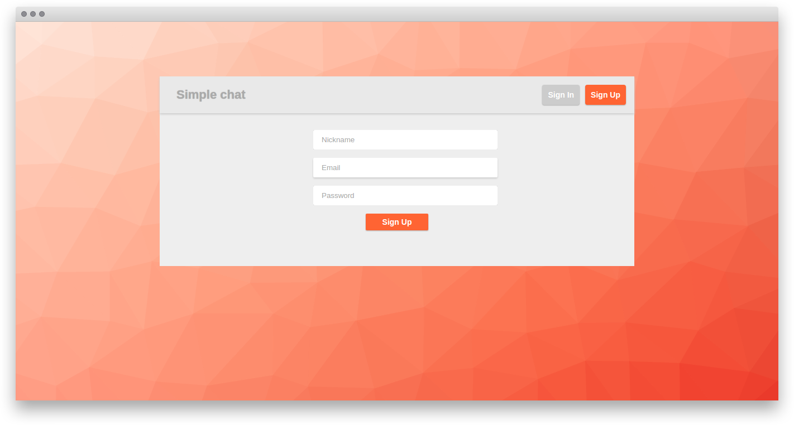

# Chat application

This is a simple chat application. It works without page reloading, using ***WebSocket***
protocol. The users are able to:

+ Sign up and sign in
+ Choose person to chat with from the list
+ Send messages
+ Read messages and delete them

This application is written in ***Python*** using its asyncronous framework ***Tornado***.
Passwords are hashed by ***Bcrypt*** library. ***MySQL*** is chosen as a database, interaction 
with it is handled py ***PyMySQL*** library.

Client side code is written in ***JavaScript*** with ***ReactJS*** library and ***Flux*** 
architecture. I have chosen ***ES6*** specification of JS, which is compiled to ES5 using ***Gulp***.
